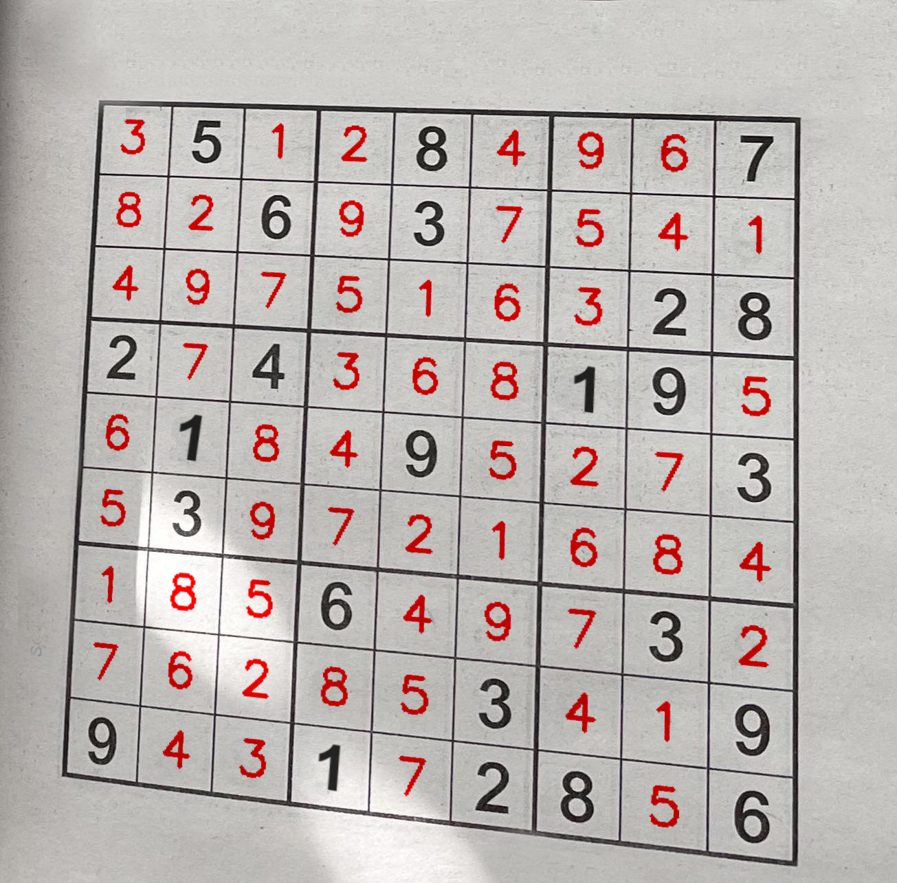

# Image Processing Techniques using OpenCV and Python

An exploration of how transforms, blurs, thresholding, and erosions/dilations
can be used to clean up a noisy source image to get reliable OCR results.

These demos were written as a part of my presentation at McKinsey Digital Discussion Hour.

## Installation

- Demos were written on Python 3.11.3

```sh
python -m venv .venv
. .venv/bin/activate
pip install -r requirements.txt
```

## [Sudoku Solver](src/sudoku_solver.py)



Solving a Sudoku puzzle using traditional computer vision techniques. The actual
"solver" is pulled from a library, but the focus of this demo is on the image
cleanup and transformations required to get reliable OCR results from Tesseract.

```sh
python src/sudoku_solver.py
```

## [Hand Tracking](src/hand_tracking.py)

Using a hand pose prediction model, we can track a hand's world position and
pose to build a digital whiteboard.

Simply raise your hand and pinch your index finger and thumb to draw on the screen.

```sh
python src/hand_tracking.py
```

You may need to modify the camera index (`cv2.VideoCapture(index)`) on line 64 if you have
multiple webcams.
